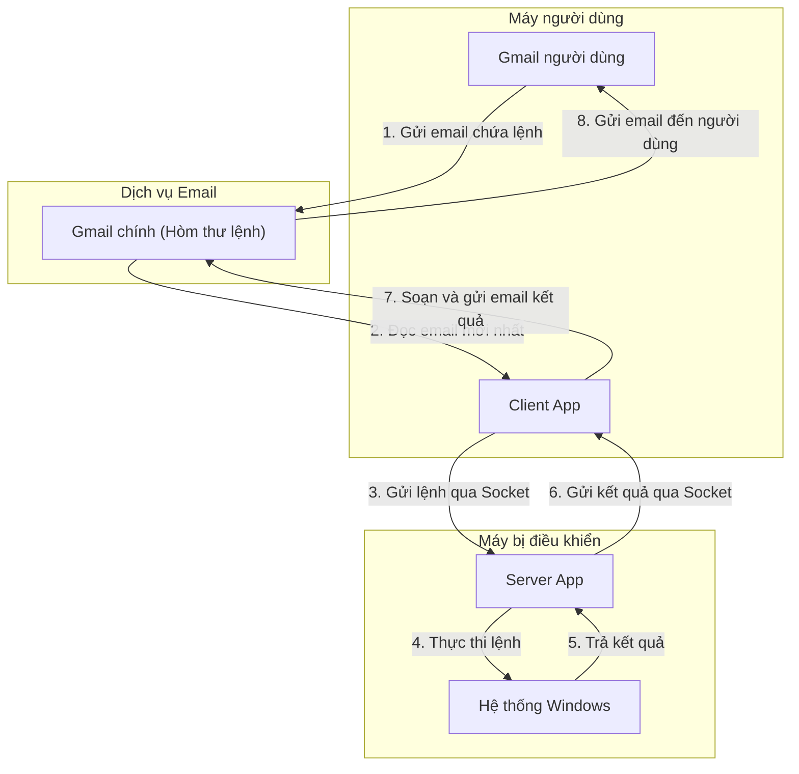

# 📧 EMAIL-CONTROLLING-PROJECT

Đây là đồ án môn học Mạng máy tính tại Trường Đại học Khoa học Tự nhiên, cho phép điều khiển một máy tính chạy hệ điều hành Windows từ xa bằng cách gửi các lệnh thông qua tài khoản Gmail.

**Tác giả:**
*   **23122003** - Nguyễn Văn Linh
*   **23122022** - Trần Hoàng Gia Bảo
*   **23122026** - Trần Chấn Hiệp

---

## 📺 Video Demo & Thuyết trình

[](https://www.youtube.com/watch?v=AFb7PMyPbHU)
*(Click vào ảnh để xem video demo trên YouTube)*

---

## 📜 Mục lục
*   [Tổng quan dự án](#-tổng-quan-dự-án)
*   [Luồng hoạt động](#-luồng-hoạt-động)
*   [Tính năng chính](#-tính-năng-chính)
*   [Kiến trúc & Công nghệ sử dụng](#-kiến-trúc--công-nghệ-sử-dụng)
*   [Cài đặt và Cấu hình](#-cài-đặt-và-cấu-hình)
*   [Hướng dẫn sử dụng](#-hướng-dẫn-sử-dụng)
*   [Danh sách các lệnh](#-danh-sách-các-lệnh)
*   [Cải tiến trong tương lai](#-cải-tiến-trong-tương-lai)

---

### 💡 Tổng quan dự án

Dự án này hiện thực hóa ý tưởng điều khiển một máy tính chạy Windows từ xa thông qua việc gửi lệnh bằng email, sử dụng một tài khoản Gmail làm trung gian giao tiếp. Hệ thống được xây dựng dựa trên mô hình Client-Server nhưng được tách biệt rõ ràng giữa kênh ra lệnh (Email) và kênh thực thi (Socket).

Hệ thống bao gồm bốn thành phần chính: **Người dùng (User)**, một **tài khoản Gmail trung gian**, **Client App** (ứng dụng khách) và **Server App** (ứng dụng chủ).

Thay vì kết nối trực tiếp, người dùng sẽ gửi một email chứa lệnh cụ thể đến tài khoản Gmail trung gian. **Client App**, chạy trên một máy bất kỳ, có nhiệm vụ liên tục kiểm tra hộp thư này. Khi phát hiện email lệnh mới, nó sẽ phân tích nội dung, trích xuất lệnh và gửi yêu cầu đến **Server App** thông qua kết nối Socket.

**Server App**, được cài đặt trên máy tính cần điều khiển, sẽ lắng nghe và thực thi lệnh này (ví dụ: chụp màn hình, quay video, quản lý tiến trình...). Kết quả sau đó được gửi trả lại **Client App** qua Socket. Cuối cùng, **Client App** sẽ sử dụng chính tài khoản Gmail trung gian để soạn và gửi một email phản hồi, đính kèm kết quả (văn bản, hình ảnh, video...), về cho người dùng ban đầu.

### 🔄 Luồng hoạt động

Dự án hoạt động dựa trên sự tương tác giữa 4 thành phần chính: **Người dùng**, **Client App**, **Server App** và một **tài khoản Gmail trung gian**.

*   **Máy người dùng (User Machine):** Nơi người dùng gửi lệnh từ tài khoản email cá nhân của mình. **Client App** có thể được chạy trên máy này hoặc một máy bất kỳ.
*   **Máy bị điều khiển (Controlled Machine):** Máy tính mục tiêu cần được điều khiển từ xa. Máy này phải luôn chạy **Server App**.
*   **Gmail chính (Main Gmail):** Là tài khoản email trung gian, đóng vai trò như một "hộp thư lệnh". Client App sẽ đọc lệnh từ đây và dùng nó để gửi kết quả về.
*   **Client App:** Đọc lệnh từ **Gmail chính**, gửi lệnh cho **Server App** qua Socket, nhận kết quả trả về, và cuối cùng dùng **Gmail chính** để gửi email chứa kết quả cho người dùng.
*   **Server App:** Lắng nghe yêu cầu từ Client App, thực thi các chức năng trên **Máy bị điều khiển** và gửi kết quả lại cho Client.

#### Sơ đồ quy trình



#### Diễn giải chi tiết

1.  **Gửi lệnh:** **Người dùng** sử dụng tài khoản email cá nhân của mình để soạn và gửi một email chứa lệnh đến **Gmail chính**.
2.  **Đọc lệnh:** **Client App** (đang chạy) kết nối đến **Gmail chính** qua giao thức IMAP, phát hiện và tải về email mới nhất để phân tích, trích xuất ra lệnh cần thực thi.
3.  **Truyền lệnh:** **Client App** gửi lệnh vừa trích xuất được đến **Server App** thông qua một kết nối Socket đã được thiết lập.
4.  **Thực thi:** **Server App** nhận được lệnh và gọi các hàm tương ứng để thực hiện tác vụ trên **Máy bị điều khiển** (ví dụ: chụp màn hình, liệt kê tiến trình,...).
5.  **Tạo kết quả:** Sau khi thực thi xong, **Server App** đóng gói kết quả (dưới dạng file ảnh, video, hoặc văn bản).
6.  **Gửi trả kết quả:** **Server App** gửi file kết quả này ngược lại cho **Client App** thông qua kết nối Socket.
7.  **Phản hồi cho người dùng:** **Client App** nhận được file kết quả. Nó sẽ đăng nhập vào **Gmail chính** qua giao thức SMTP, soạn một email mới, đính kèm kết quả và gửi email đó đến địa chỉ **Gmail người dùng** ban đầu.
8.  **Hoàn tất:** Người dùng nhận được email phản hồi chứa kết quả cho lệnh mà mình đã yêu cầu.
## ✨ Tính năng chính

Ứng dụng cho phép thực hiện các tác vụ điều khiển từ xa sau:

*   **🖥️ Điều khiển hệ thống:**
    *   `shutdown`: Tắt máy tính của Server.
*   **📸 Tác vụ màn hình & Webcam:**
    *   `screenshot`: Chụp ảnh màn hình máy Server và gửi lại file ảnh.
    *   `recording [seconds]`: Quay video màn hình trong một khoảng thời gian (`seconds`) và gửi lại file video.
    *   `turn_on_webcam` / `turn_off_webcam`: Bật/tắt webcam của máy Server.
*   **📂 Quản lý file:**
    *   `fetch [path]`: Yêu cầu Server gửi một file cụ thể từ đường dẫn `[path]`.
*   **📋 Quản lý tiến trình & Dịch vụ:**
    *   `list_app`: Liệt kê các ứng dụng đang chạy.
    *   `start_app [app_name]` / `stop_app [app_name]`: Bật/tắt một ứng dụng.
    *   `list_service`: Liệt kê các dịch vụ hệ thống của Windows.
    *   `start_service [service_name]` / `stop_service [service_name]`: Bật/tắt một dịch vụ.

## 🛠️ Kiến trúc & Công nghệ sử dụng

*   **Ngôn ngữ lập trình:** C++
*   **Mô hình:** Client-Server
*   **Giao thức mạng:** TCP/IP (sử dụng Windows Sockets - Winsock)
*   **Giao diện người dùng (Client):** Windows Forms (WinForms) trong Visual Studio.
*   **Thư viện chính:**
    *   `Winsock2`: Thư viện nền tảng cho lập trình mạng trên Windows.
    *   `OpenCV`: Xử lý các tác vụ liên quan đến hình ảnh và video (chụp màn hình, quay phim, webcam).
    *   `libcurl`: Gửi email kết quả về cho người dùng qua giao thức SMTP.
    *   `EAGetMail`: Đọc và phân tích email từ server Gmail qua giao thức IMAP.
    *   Thư viện chuẩn của Windows API để quản lý tiến trình và dịch vụ.

---

## ⚙️ Cài đặt và Cấu hình

Để chạy được dự án, bạn cần môi trường Visual Studio và cấu hình một số thư viện ngoài.

#### 1. Yêu cầu
*   Microsoft Visual Studio (khuyến nghị 2019 hoặc mới hơn) với workload "Desktop development with C++".
*   Các thư viện đã được tải về và giải nén (OpenCV, libcurl, EAGetMail).

#### 2. Sao chép mã nguồn
```bash
git clone https://github.com/trhgbao/EMAIL-CONTROLLING-PROJECT.git
cd EMAIL-CONTROLLING-PROJECT
```

#### 3. Cấu hình trong Visual Studio
1.  Mở file solution (`.sln`) của dự án bằng Visual Studio.
2.  Chuột phải vào project trong **Solution Explorer** và chọn **Properties**.
3.  Đảm bảo bạn đang cấu hình cho tất cả các nền tảng (**All Platforms**) và cấu hình (**All Configurations**).

4.  **Thêm đường dẫn Include:**
    *   Vào `C/C++` -> `General`.
    *   Trong mục `Additional Include Directories`, thêm đường dẫn đến các thư mục `include` của OpenCV và các thư viện khác.
    *   *Ví dụ:* `D:\libraries\opencv\build\include`

5.  **Thêm đường dẫn Library:**
    *   Vào `Linker` -> `General`.
    *   Trong mục `Additional Library Directories`, thêm đường dẫn đến thư mục `lib` của OpenCV.
    *   *Ví dụ:* `D:\libraries\opencv\build\x64\vc16\lib`

6.  **Thêm các file thư viện phụ thuộc:**
    *   Vào `Linker` -> `Input`.
    *   Trong mục `Additional Dependencies`, thêm các file `.lib` cần thiết.
    *   *Ví dụ:*
        ```
        opencv_world410d.lib
        // Thêm các file .lib khác của libcurl, Eagetmail...
        ```

---

## 🚀 Hướng dẫn sử dụng

1.  **Chạy Server:** Biên dịch và chạy file thực thi của **Server**. Server sẽ bắt đầu lắng nghe kết nối từ Client trên một cổng được định sẵn (ví dụ: 8080).
2.  **Chạy Client:**
    *   Biên dịch và chạy file thực thi của **Client**.
    *   Trên giao diện GUI, nhập các thông tin sau:
        *   **Gmail của Client:** Địa chỉ email và mật khẩu ứng dụng mà chương trình sẽ dùng để nhận lệnh.
        *   **Gmail người dùng:** Địa chỉ email của bạn (người gửi lệnh) để Client xác thực.
        *   **IP của Server:** Địa chỉ IP của máy đang chạy Server.
    *   Nhấn nút "Khởi động".
3.  **Gửi lệnh:**
    *   Từ tài khoản email người dùng đã đăng ký, gửi một email đến tài khoản email của Client.
    *   **Tiêu đề (Subject)** và **Nội dung (Body)** của email chính là các lệnh bạn muốn thực thi.
4.  **Nhận kết quả:** Sau khi Server xử lý xong, Client sẽ tự động gửi một email chứa kết quả về cho bạn.

---

## 📝 Danh sách các lệnh

| Lệnh | Tham số | Mô tả |
| :--- | :--- | :--- |
| `shutdown` | - | Tắt máy tính Server. |
| `screenshot` | - | Chụp ảnh màn hình và gửi lại. |
| `turn_on_webcam` | - | Mở webcam trên máy Server. |
| `turn_off_webcam`| - | Tắt webcam đang mở. |
| `recording` | `[số giây]` | Ghi lại màn hình trong `[số giây]` và gửi lại video. |
| `fetch` | `"[đường_dẫn]"` | Tải file từ `"[đường_dẫn]"` trên máy Server. |
| `list_app` | - | Liệt kê các ứng dụng đang chạy. |
| `start_app` | `"[tên_app]"` | Khởi chạy một ứng dụng. |
| `stop_app` | `"[tên_app]"` | Dừng một ứng dụng đang chạy. |
| `list_service` | - | Liệt kê các dịch vụ hệ thống. |
| `start_service` | `"[tên_dịch_vụ]"` | Bắt đầu một dịch vụ hệ thống. |
| `stop_service` | `"[tên_dịch_vụ]"` | Dừng một dịch vụ hệ thống. |

---

## 📈 Cải tiến trong tương lai

-   [ ] Tối ưu hóa kết nối Client-Server để mượt mà và ổn định hơn.
-   [ ] Thêm các chức năng điều khiển hữu ích khác (ví dụ: quản lý registry, khóa máy).
-   [ ] Cho phép ứng dụng hoạt động qua mạng Internet thay vì chỉ trong mạng LAN.
-   [ ] Cải thiện giao diện người dùng (GUI) của Client.
-   [ ] Mã hóa dữ liệu truyền tải giữa Client và Server để tăng cường bảo mật.
